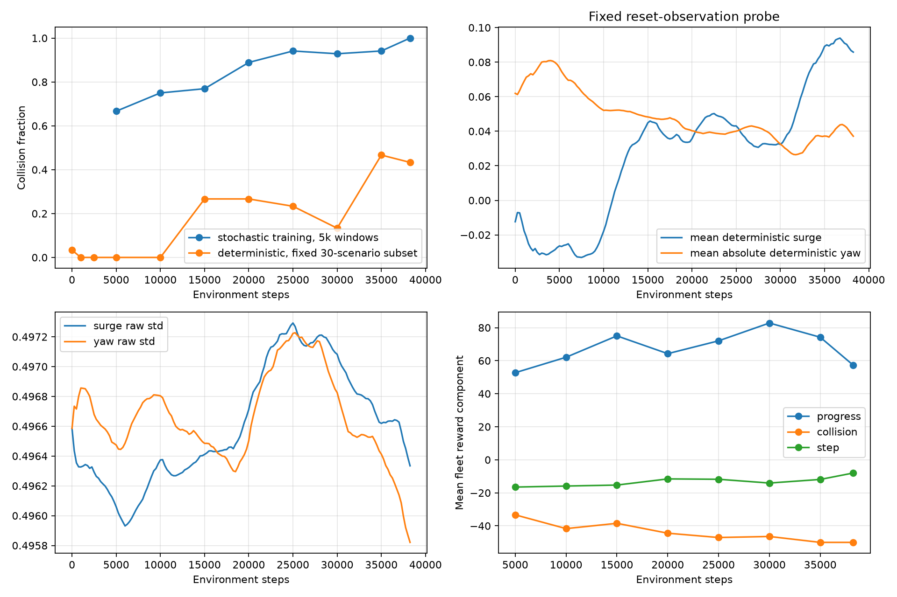
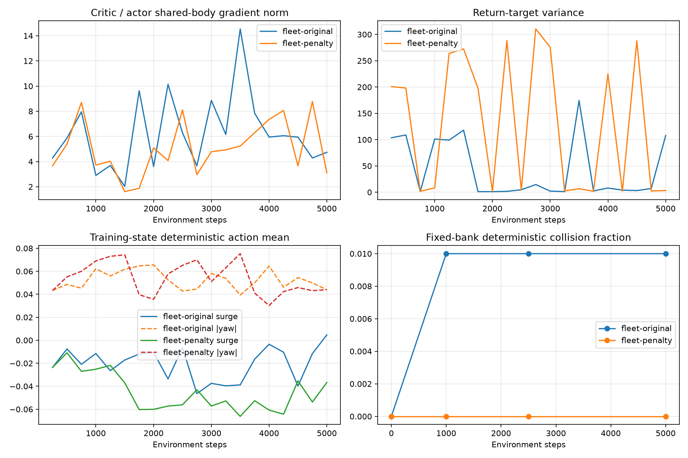

# Shared RL learning audit

Historical baseline: this document describes the objective before the fleet-wide collision penalty, time-based discount, and potential shaping were implemented. Its gamma and reward statements refer to that earlier run; the current contract is in [three_sim_benchmark.md](three_sim_benchmark.md).

## 1. Executive finding

The current individual-return objective is misaligned with fleet safety. The supplied run reaches 38,250 environment steps and 153 optimizer updates, with zero fleet successes and 103 collisions in 118 completed episodes (87.29%). **51/103 collision episodes (49.5%) nevertheless earn positive undiscounted fleet return.** The learning curves confirm greater dense progress without goal achievement. This is supported by an independently constructed same-map reward ordering inversion, not inferred from collisions alone.

No BCOD plant, vessel coefficients, actuator limits, simulator-specific control behavior, production reward weights, gamma, architecture, optimizer or update interval was changed. Instrumentation was added to the common scorer/runner. The all-agent terminal penalty is confined to the explicitly labeled diagnostic experiment. No long comparative training campaign was started.

The historical log contains one run ID and the expected step/250 optimizer schedule. The checkpoint path printed in that log is relative to the original training host; this audit uses the user-supplied downloaded files directly. Original logs and checkpoint hashes are preserved under `artifacts/shared-rl-audit/historical-inputs`. Its last extra episode row beyond checkpoint 38,250 is excluded from aligned historical statistics. Per-agent discounted returns and gradient diagnostics were absent from the old logs and cannot be reconstructed exactly; new instrumented evaluations/probes supply those measurements instead.

## 2. Deterministic vs stochastic learning curves

The initial and final native BCOD checkpoints use 100 fixed nominal scenarios, seeds 700000–700099, persisted with hashes in `nominal-100`. Intermediate checkpoints use the identical first 30 scenarios as a bounded common subset; their N is shown explicitly. The step-0 and final checkpoint were also analyzed on that same 30-scenario subset for direct intermediate comparisons, while the 100-scenario endpoint estimates are reported separately. Step 0 reconstructs the untrained network using the recorded seed 11 and unchanged architecture; later policies load the user's checkpoints. Each stochastic episode uses the same fixed sampling seed 800000 + scenario index. No evaluation updates model weights. Per-agent success, episode length, path efficiency, returns and action distributions are stored in each evaluation's JSON.

| Checkpoint | N | Fleet success | Collision | Δ collision vs step 0 | Mean fleet return | Mean length | Path efficiency |
| --- | --- | --- | --- | --- | --- | --- | --- |
| 0 | 30 | 0.000 | 0.033 | 0.000 | -18.836 | 594.267 | 0.000 |
| 1000 | 30 | 0.000 | 0.000 | -0.033 | -18.602 | 600.000 | 0.000 |
| 2500 | 30 | 0.000 | 0.000 | -0.033 | -20.300 | 600.000 | 0.000 |
| 5000 | 30 | 0.000 | 0.000 | -0.033 | -18.798 | 600.000 | 0.000 |
| 10000 | 30 | 0.000 | 0.000 | -0.033 | -16.116 | 600.000 | 0.000 |
| 15000 | 30 | 0.000 | 0.267 | 0.233 | -6.466 | 531.600 | 0.000 |
| 20000 | 30 | 0.000 | 0.267 | 0.233 | -9.434 | 543.600 | 0.000 |
| 25000 | 30 | 0.000 | 0.233 | 0.200 | -4.242 | 533.500 | 0.000 |
| 30000 | 30 | 0.000 | 0.133 | 0.100 | -4.816 | 575.733 | 0.000 |
| 35000 | 30 | 0.000 | 0.467 | 0.433 | 6.244 | 453.433 | 0.000 |
| 38250 | 30 | 0.000 | 0.433 | 0.400 | 5.478 | 492.967 | 0.000 |

Full-bank endpoint estimates:

| Checkpoint | N | Success | Collision | Mean fleet return | Mean length |
| --- | --- | --- | --- | --- | --- |
| 0 | 100 | 0.000 | 0.020 | -18.943 | 595.940 |
| 38250 | 100 | 0.000 | 0.410 | 7.078 | 514.190 |

| Frozen stochastic policy | N | Fleet success | Collision | Mean return |
| --- | --- | --- | --- | --- |
| bcod-initial-stochastic | 100 | 0.000 | 0.760 | 6.455 |
| bcod-final-stochastic | 100 | 0.000 | 0.890 | 18.613 |

Historical stochastic training uses changing policies and training scenarios; it must not be subtracted from fixed-bank deterministic results as a pure causal exploration effect. The frozen initial/final stochastic evaluations provide matched-policy comparisons. Fractional changes in the table are absolute changes, not relative percentages. Zero collision alone is not success: an almost stationary policy can time out safely.

## 3. Per-agent/fleet reward decomposition

Fleet termination applies to everyone, but the production −50 penalty applies only to physically colliding agents. The other agents lose future rewards yet can have positive immediate reward and positive trajectory return. The current actor loss multiplies each agent's log probability by its **own** advantage. In the six-update native frozen-policy probe, five updates contain collisions. The summed actor-gradient contribution of colliding agents has negative cosine with the other agents' summed contribution in **4/5** of these updates (cosines −0.108, −0.372, +0.467, −0.101, −0.684). Total actor-gradient norm is 0.515–0.758 of the sum of individual norms. These are full-rollout contributions grouped by agents involved in that update's collisions, not terminal-only gradients or a causal percentage of historical failures. Positive returns do not by themselves prove oppositely directed parameter gradients; their actual directions depend on sampled actions and baselines. The frozen native gradient probe records per-agent gradient norms/cosines and the norm of their sum divided by the sum of norms.

Every new episode JSON records `colliding_agents`, terminal rewards, per-agent cumulative and discounted returns, fleet totals, component totals, the ten preterminal rewards, positive-reward streak lengths, and reached-then-left/post-goal collision events. Collision rows in these files are the requested per-episode report; percentages below refer to their own recorded samples, not retroactively to the 118 historical episodes.

| Instrumented sample | Collision episodes | Positive fleet | Positive discounted fleet | ≥3 positive agents | ≥3 positive discounted agents |
| --- | --- | --- | --- | --- | --- |
| bcod-eval-38250 | 41 | 0.000 | 0.951 | 0.512 | 0.780 |
| bcod-final-stochastic | 89 | 0.562 | 0.966 | 1.000 | 1.000 |
| bcod-frozen-gradient-probe | 6 | 0.333 | 1.000 | 1.000 | 1.000 |
| fleet-original | 10 | 0.000 | 0.900 | 1.000 | 1.000 |
| fleet-penalty | 11 | 0.000 | 0.455 | 0.000 | 0.364 |

In the latest-policy frozen native probe, the ten immediately preceding step rewards and consecutive positive-reward streak are stored per vessel. They show whether progress was rewarded before a terminal penalty; the historical JSON cannot answer that per-step question. All instrumented collision rows are also gathered in `artifacts/shared-rl-audit/collision-episodes.jsonl`, each with its source file, so terminal rewards and per-agent returns can be reviewed episode by episode.

The historical fleet component decomposition is reconstructible exactly from total reward, collision count, step count and latched goal flags: progress = total − goal bonuses − collision penalties − step penalties. All historical goal bonuses are zero.

| Window end | Collision fraction | Progress | Goals | Collision penalty | Step penalty |
| --- | --- | --- | --- | --- | --- |
| 5000 | 0.667 | 52.733 | 0.000 | -33.333 | -16.510 |
| 10000 | 0.750 | 62.086 | 0.000 | -41.667 | -15.893 |
| 15000 | 0.769 | 75.024 | 0.000 | -38.462 | -15.298 |
| 20000 | 0.889 | 64.260 | 0.000 | -44.444 | -11.573 |
| 25000 | 0.941 | 72.032 | 0.000 | -47.059 | -11.791 |
| 30000 | 0.929 | 82.807 | 0.000 | -46.429 | -14.074 |
| 35000 | 0.941 | 74.203 | 0.000 | -50.000 | -11.894 |
| 38250 | 1.000 | 57.263 | 0.000 | -50.000 | -7.995 |

On the *same historical trajectories*, charging every agent −50 would reduce positive-return collision episodes from 51/103 to 0/103. This is counterfactual reward accounting, not evidence that a retrained policy would have followed those trajectories.

### Temporary learning ablation

Matched native Pyquaticus runs use seed 11, 5,000 joint steps, update interval 250 (20 updates), learning rate 3e-4, fresh distinct directories, and the same fixed evaluation bank. Both start from identical parameters. `fleet-penalty` changes only terminal penalty recipients inside the diagnostic loop; physical termination/collision checks are unchanged. Evaluation rewards always use the original scorer to make metrics comparable. Policy-dependent episode lengths may change later training-scenario exposure even with the same episode seed sequence. One seed and 20 updates measure initial direction, not convergence or causal contribution percentages.

| Reward | Step | N | Deterministic success | Collision | Mean surge | Mean absolute yaw |
| --- | --- | --- | --- | --- | --- | --- |
| fleet-original | 0 | 100 | 0.000 | 0.000 | -0.021 | 0.064 |
| fleet-original | 1000 | 100 | 0.000 | 0.010 | -0.033 | 0.057 |
| fleet-original | 2500 | 100 | 0.000 | 0.010 | -0.036 | 0.048 |
| fleet-original | 5000 | 100 | 0.000 | 0.010 | -0.023 | 0.046 |
| fleet-penalty | 0 | 100 | 0.000 | 0.000 | -0.021 | 0.064 |
| fleet-penalty | 1000 | 100 | 0.000 | 0.000 | -0.042 | 0.064 |
| fleet-penalty | 2500 | 100 | 0.000 | 0.000 | -0.057 | 0.055 |
| fleet-penalty | 5000 | 100 | 0.000 | 0.000 | -0.049 | 0.043 |

## 4. Discounted-return analysis

Gamma remains 0.99 at 5 Hz. Discount factors are: 1 s **0.9510**, 10 s **0.6050**, 20 s **0.3660**, 40 s **0.1340**, 60 s **0.04904**, and 120 s **0.002405**. The reward half-life is about 13.79 simulated seconds. A −50 collision at 60 s is weighted only about −2.45 from the start; a +20 goal at 120 s contributes about +0.048.

Prescribed trajectories run through the actual common scorer, with a 72 m goal and the same obstacle at x=65 m for aggressive collision, safe detour and avoidance-away-first. The direct-success comparator moves the obstructing obstacle aside and is explicitly a different geometry. These are reward calculations, not claims that a vessel can instantaneously follow the prescribed motion. Inactive distant objects keep valid scenario structure; only vessel 0 hits the obstacle. Every trajectory JSON includes both forms of return for all four agents.

| Trajectory | Steps | Fleet return | Discounted fleet return | Per-agent discounted returns |
| --- | --- | --- | --- | --- |
| aggressive_collision | 158 | 196.480 | 113.802 | 20.710, 31.031, 31.031, 31.031 |
| slow_safe_detour | 544 | 338.518 | 22.937 | 5.734, 5.734, 5.734, 5.734 |
| partial_timeout | 600 | 96.000 | 58.293 | 14.573, 14.573, 14.573, 14.573 |
| stationary | 600 | -24.000 | -3.990 | -0.998, -0.998, -0.998, -0.998 |
| direct_success | 350 | 346.000 | 76.143 | 19.036, 19.036, 19.036, 19.036 |
| avoidance_away_first | 504 | 339.958 | 1.368 | 0.342, 0.342, 0.342, 0.342 |

**The unsafe approach outranks the safe detour in the actual discounted reward sum: 113.802 vs 22.937**, despite the safe detour winning undiscounted (338.518 vs 196.480). Even the colliding vessel's discounted return, 20.710, exceeds its safe-detour return, 5.734. All-agent collision penalties lower aggressive fleet return to 46.480 undiscounted / 82.841 discounted, still above the safe discounted return. Thus terminal reward alignment alone is insufficient for this example.

Reported timeout returns are finite observed reward sums, not bootstrapped critic targets. The learner separately bootstraps the final timeout observation. Dense progress `d_before - d_after` is not discount-adjusted: moving closer now and reversing later can have positive discounted progress even when net distance gain is zero. Offline sensitivity of the same reward sequences: at gamma=.995, crash/safe fleet returns are 147.92/71.09; at .997 they are 165.33/124.40; at .999 they are 185.37/237.02. The ordering reverses by .999 in this fixture, but this is not a validated new benchmark discount or a learning result. No gamma or reward change has been made in response to these calculations.

## 5. Actor/critic diagnostics

`updates.jsonl` records actor/critic/total loss, Monte Carlo squashed-Gaussian differential entropy, mean/std/min/max advantage, target mean/std, predicted mean value, explained variance, and preclip gradient norms for shared body, actor head, critic head and log_std. It also separately differentiates actor and critic losses through the shared body. Explained variance is null for effectively constant targets. Entropy is diagnostic only; no entropy bonus was introduced.

| Experiment | Updates | Median critic/actor body norm | Collision-update ratio | Mean clip scale | Mean bootstrap fraction | Target variance range |
| --- | --- | --- | --- | --- | --- | --- |
| ladder-E | 20 | 7.116 | 2.051 | 0.344 | 0.993 | [1.75, 73.16] |
| ladder-B | 20 | 6.568 | 5.386 | 0.107 | 0.895 | [0.89, 256.94] |
| ladder-C | 20 | 4.907 | 3.190 | 0.261 | 0.965 | [0.62, 220.31] |
| ladder-D | 20 | 3.518 | 1.746 | 0.166 | 0.959 | [1.03, 251.13] |
| bcod-frozen-gradient-probe | 6 | 4.787 | 4.769 | 0.137 | 0.586 | [5.03, 180.32] |
| ladder-A-v2 | 20 | 4.368 | N/A | 0.332 | 1.000 | [0.8, 9.56] |
| fleet-original | 20 | 5.944 | 4.282 | 0.239 | 0.767 | [1.04, 174.24] |
| fleet-penalty | 20 | 4.856 | 3.849 | 0.172 | 0.799 | [1.28, 310.42] |

Large preclip critic/body ratios show representation gradients dominated in magnitude by value fitting. Global norm-1 clipping scales the entire gradient; logged clip factors quantify this. Adam's adaptive rescaling means a raw norm ratio is **not** a measured percentage of the eventual parameter update, and it does not establish that critic interference alone causes collisions. The native frozen-policy probe uses the actual latest BCOD policy, 1,500 steps and learning rate zero, and verifies bitwise unchanged model weights.

### Policy-gradient and return verification

The sampled raw Gaussian action is detached (`sample`, not `rsample`). The squashed density subtracts `log(1-tanh(raw)^2)` using its stable softplus form. For score-function gradients at a fixed raw sample, that Jacobian contributes no parameter gradient. Actor advantages are detached; reward and bootstrap tensors are detached explicitly. Critic gradients cannot leak through the advantage into the actor loss.

Analytic tests verify gamma=.5 rewards [1,1,1] produce [1.75,1.5,1], a later episode cannot leak into an earlier terminal episode, interleaved environments remain independent, terminal bootstrap is zero, and timeout/tail bootstrap uses the final state. A fixed raw sample .5 with unit Gaussian variance produces actor-mean loss gradient −.5 and log_std gradient +.75 under positive unit advantage, with no critic gradient from the actor term. The loss averages sampled timesteps uniformly and does not multiply each actor term by an additional episode-origin gamma^t factor. Together with finite chunks and value bootstrapping, this is a local n-step actor-critic update, not an exact whole-episode REINFORCE estimator of the reported start-state discounted fleet sum. The reward-ranking table establishes adverse discounted credit signals; it is not a numeric reconstruction of the optimizer loss. These tests validate the implemented **individual-return** objective. They do not turn it into an unbiased centralized fleet-return policy gradient: interacting agents' cross-reward terms are absent.

### Update horizon

250 steps = 50 simulated seconds. Historical mean episode length is 321.11 steps (64.22 s), median 270 (54 s). 69.93% of the 153 updates contain at least one episode boundary; only 0.0784 episodes per update are entirely contained within that update. Return targets therefore mix finite terminal returns with substantial value bootstrapping. Per-update variance is retained in JSON and plotted below; horizon and gamma are unchanged. Exact bootstrap fractions in the summary are recomputed from episode boundaries, including timeouts, rather than assuming all nonterminal rows have independent one-step bootstraps.

## 6. Action-distribution evolution

On a fixed bank of 400 reset observations, the historical policy changes mean deterministic surge from **−0.01239 to +0.08581**, and mean absolute deterministic yaw from **0.06195 to 0.03712**. Negative deterministic surge drops from 57.25% to 2.25%. Raw Gaussian std remains approximately **0.4966 → 0.4963 (surge), 0.4958 (yaw)**. This supports increasing forward bias/reduced turning, but does **not** support a claim that deterministic surge saturates near +1. Most action randomness remains.

These probes are distinct from trajectory-weighted action statistics in each evaluation/update. Logs include tanh(actor mean), sampled actions, empirical action std across states/samples, raw conditional std, log_std, |action|>.95 fractions, negative-surge fraction and mean |yaw|. Negative surge commands request zero forward speed in the existing adapters, so part of Gaussian exploration lies in a non-moving command range; this behavior was not altered.

## 7. Observation sufficiency

The three nearby-agent slots contain only range and bearing. Heading, speed and relative velocity are absent; the shared policy has no recurrent state. `observation-alias.json` constructs three distinct full states with another vessel at (10,10), traveling south at 1 m/s, north at 1 m/s, or stationary. Own pose is (0,0), heading East, speed 1 m/s. All 47 observations are exactly equal. Under constant-velocity motion their separation after 10 s is respectively 0, 20 and 10 m. This is an information proof, not a simulator trajectory forecast.

Consequently, a single-frame policy cannot choose different actions based on those different motions. Reactive conservative avoidance can still succeed in some layouts, so this limitation alone does not prove unavoidable failure. No observation or recurrent architecture change was made.

## 8. Simple-task learning ladder

Native Pyquaticus is used for short diagnostics. A: one active vessel, clear straight 40 m goal; B: same with initial 90° turn; C: one blocking circle; D: six static obstacles; E: four crossing vessels without static obstacles; F: normal four-vessel nominal task. A–D retain three stationary vessels at distant completed goals to satisfy the four-vessel API, but only the active vessel's records enter the learner. Its successful arrival determines fleet success. Parked-agent goal bonuses remain in logged fleet accounting but do not enter the single-agent training loss; compare success within a task, not fleet returns across ladder levels. The opt-in sparse-scenario validation is diagnostic-only; production validation still requires 6–10 obstacles.

A–D geometry is fixed across the 20 seed-labelled evaluation repetitions; these repetitions do not represent 20 distinct layouts. E uses 20 fixed seeded crossing geometries; F uses 100 fixed nominal geometries. Every run uses the same learner and 5,000 steps/20 optimizer updates, evaluated at 0, 1k, 2.5k and 5k.

| Task | Completed training steps | Initial success | Final deterministic success | Final collision |
| --- | --- | --- | --- | --- |
| A | 5000 | 0.0 | 0.0 | 0.0 |
| B | 5000 | 0.0 | 0.0 | 0.0 |
| C | 5000 | 0.0 | 0.0 | 0.0 |
| D | 5000 | 0.0 | 0.0 | 0.0 |
| E | 5000 | 0.0 | 0.0 | 0.0 |
| F | 5000 | 0.0 | 0.0 | 0.01 |

A lack of success within 20 updates is a failed learning sanity check, not mathematical proof of an implementation bug. Analytic gradient/return tests and the scripted controls must be considered alongside this result. These runs do not justify escalating to a long full-task campaign or switching algorithms without addressing the objective first.

## 9. Scripted/oracle baseline

Both baseline variants use the same reactive goal-attraction/obstacle-repulsion rule and 0.25 rad/s command ceiling. Observation-only uses the permitted 47-vector and visible proximity slots, with conservative assumed clearance because obstacle radius is not present. Truth-access receives all obstacle/agent positions, including those beyond visibility. Neither uses native reward, future trajectories, velocity prediction or an optimal planner. Thus this is a **truth-access geometric baseline**, not a perfect oracle; failure of both cannot establish that geometry is unsolvable.

| Task | Access | N | Success | Collision |
| --- | --- | --- | --- | --- |
| A | observation | 20 | 1.000 | 0.000 |
| A | truth | 20 | 1.000 | 0.000 |
| B | observation | 20 | 1.000 | 0.000 |
| B | truth | 20 | 1.000 | 0.000 |
| C | observation | 20 | 1.000 | 0.000 |
| C | truth | 20 | 1.000 | 0.000 |
| D | observation | 20 | 1.000 | 0.000 |
| D | truth | 20 | 1.000 | 0.000 |
| E | observation | 20 | 0.900 | 0.000 |
| E | truth | 20 | 0.900 | 0.000 |
| F | observation | 20 | 0.500 | 0.000 |
| F | truth | 20 | 0.500 | 0.000 |

The observation-only controller succeeds on A–D (20/20 each), E (18/20) and F (10/20), with zero collisions in each evaluated set. The truth-access version has the same success rates. This shows meaningful nominal success is possible from permitted information; the missing relative velocity is a limitation, not an explanation sufficient by itself for zero learned success. The clear straight/turn and one-obstacle observation-only successes establish useful control authority without hidden state. Compare E/F to the simpler tasks to assess multi-agent complexity, while retaining the above controller limitations.

## 10. Confirmed bugs

No incorrect score-function sign, tanh-density gradient, episode-boundary return propagation, cross-environment return leak, or incorrect current timeout bootstrap was found by the new analytic tests. The audit did find missing observability in the **logs**: combined loss concealed actor/critic balance, training collisions were being discussed without deterministic evaluation, and no per-agent reward decomposition was retained. These diagnostics are now implemented.

The reward/termination mismatch is confirmed behavior, classified below as an objective-design problem rather than silently fixed as a simulator defect. Explicit reward detachment was added defensively; actual environment rewards were already non-gradient Python floats. The loss was factored into separately logged actor/critic terms with the same mathematical weighting. **Validation: 57 benchmark tests passed**, including a bitwise optimizer-update equivalence test with diagnostics enabled versus disabled. `git diff --check` and compilation of benchmark/audit modules passed. The full repository suite was not repeated for this shared-learner audit.

Completed-agent semantics remain unchanged: reached is latched, agents continue receiving actions, and a later collision still terminates fleet success. The historical run has **zero goal bonuses**, hence no already-completed-agent collisions can explain its observed failure. Instrumented episode files separately record reached-then-left and post-goal collisions. This design may matter for better policies but is not established as the cause here.

## 11. Objective-design problems

1. Fleet failure terminates everyone's opportunity, but only physically colliding agents receive the terminal penalty. The local-return shared-policy update omits other agents' reward consequences of an action; it is not a centralized fleet-return gradient estimator.
2. Immediate progress can outweigh delayed safety under gamma=.99. The same-map trajectory test demonstrates an actual unsafe/safe ranking inversion, including for the colliding agent individually.
3. Reaching later receives very little weight from early states; moving temporarily away from the goal to avoid an obstacle is especially disfavored. Observed 5k-window progress increases with collision penalties while goal rewards remain zero.
4. Timeout bootstrapping implements the previously declared continuing-navigation value semantics, while benchmark success is judged within 120 s. If the intended objective is strictly finite-horizon success, this is another semantic mismatch: the observation omits remaining time, and the value target credits continuation beyond the scored deadline. The implementation is consistent with its declared convention; deciding whether timeout should be terminal requires an explicit task-objective decision, not an unannounced bootstrap change.
5. Safe inactivity can avoid collision yet never solve the task. Collision reduction alone is an insufficient ablation success criterion.

## 12. Algorithm limitations

The actor-critic is a basic on-policy individual-return learner with a shared representation, no advantage normalization, no entropy objective, no recurrent history and 250-step rollout chunks. These are declared design choices, not automatically bugs. Value-error gradients and high target variance can impede efficient policy learning; measurements quantify gradients, not causal attribution percentages. Twenty updates may be inadequate even for the simple ladder, and the short ablation is not a convergence study. Historical initial exploration remains large throughout optimization.

Do not infer that PPO/SAC/MAPPO would repair an incorrectly ranked reward objective. Likewise, equal observation vectors for different relative velocities cannot be disambiguated by changing the feed-forward optimizer.

## 13. Recommended minimal fix

Keep simulator physics and the algorithm fixed. First make a deliberate **fleet-objective decision**: if any collision means team failure, align terminal failure feedback across all agents, and specify whether learning targets are individual returns or a shared team return. The diagnostic all-agent penalty is evidence for that decision, not a silently adopted production reward.

Then correct the discounted safety/success ordering before any long run. Terminal penalty broadcast alone does not fix the demonstrated example. Evaluate candidate discount horizons and/or discount-consistent progress shaping against the prescribed trajectories, including movement away from the goal; do not pick new values merely because training curves look better. This audit leaves gamma and shaping unchanged.

Require improved deterministic success on A/B and then the remaining ladder, retain fixed-bank deterministic and stochastic evaluations, and monitor actor/critic gradients and per-agent terminal rewards. Only after a coherent objective learns the simple cases should relative velocity/history or actor/critic gradient separation be tested as isolated ablations. No new long comparative run is recommended.

Reproduction: `python -m bcod_sim.benchmark.audit_learning train --kind F --output <fresh-dir>` runs the original 5k diagnostic; add `--fleet-penalty` for the temporary terminal-penalty ablation. Use `evaluate --sim bcod --checkpoint <file> --output <fresh-dir>` for 100 fixed nominal scenarios; omit checkpoint for reconstructed initial policy and add `--stochastic` for sampled actions. `tools/audit_shared_rl_rewards.py`, `tools/audit_shared_rl_observability.py`, `tools/audit_shared_rl_checkpoint_actions.py`, and `tools/report_shared_rl_audit.py` reproduce calculations/plots. Historical helper defaults identify the supplied local checkpoint directory. Full traces and metrics are under `artifacts/shared-rl-audit`.

B. reward/objective misalignment
